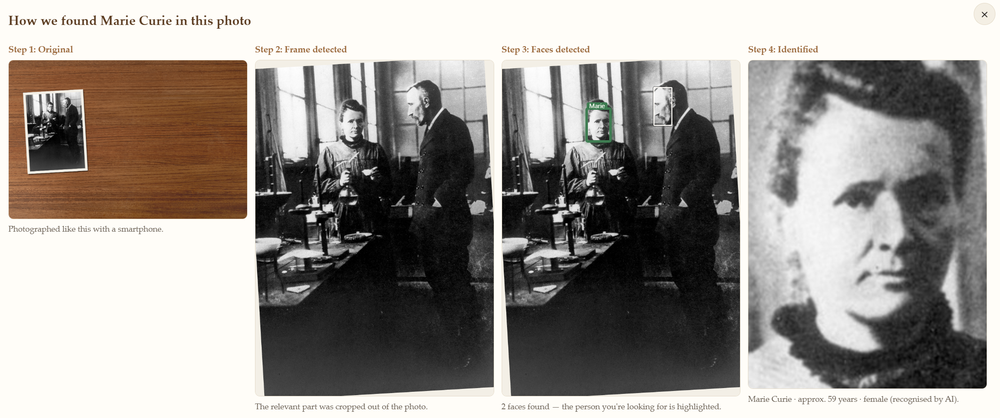
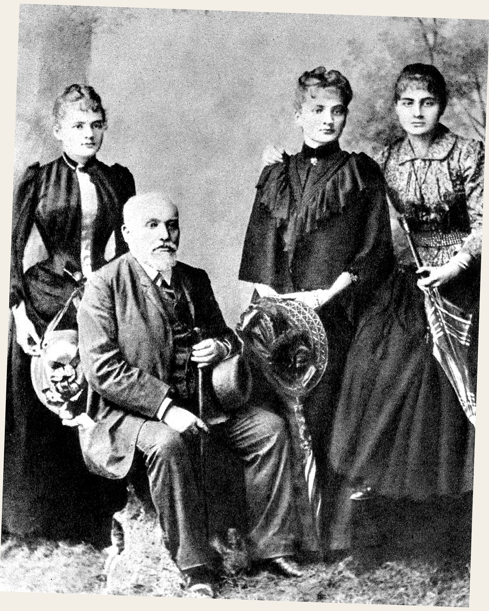
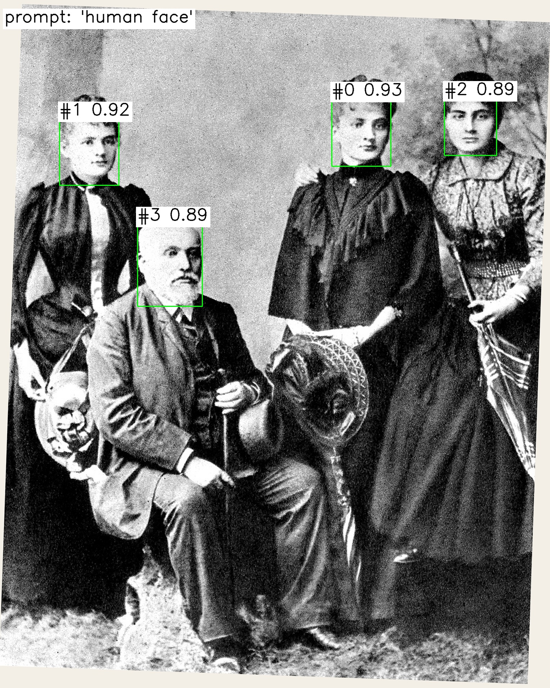
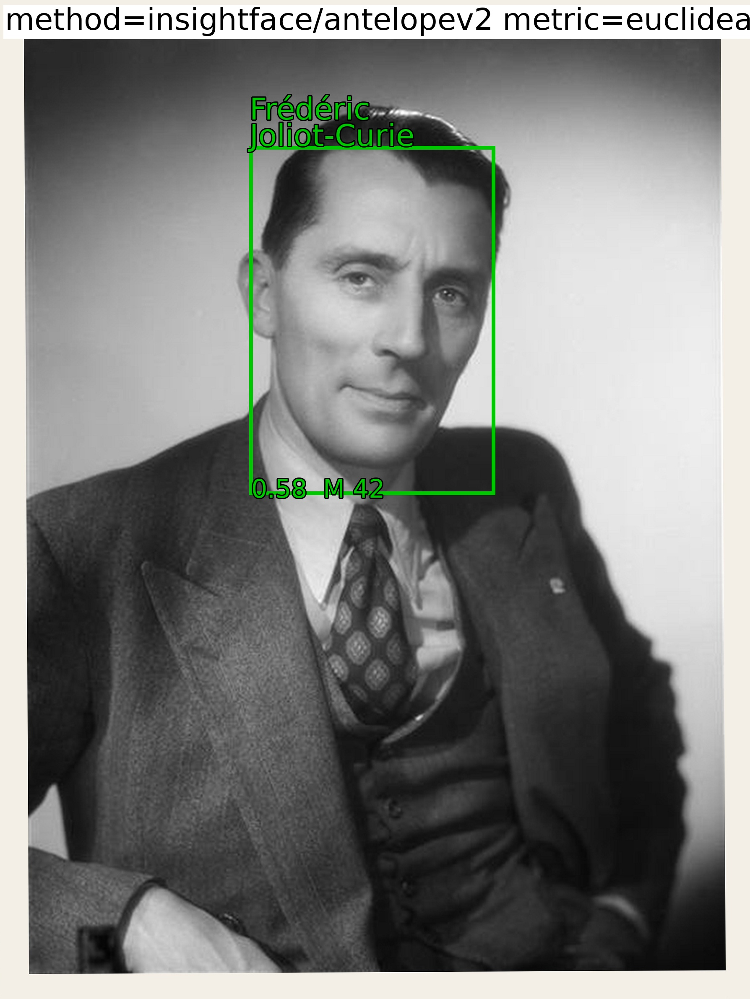
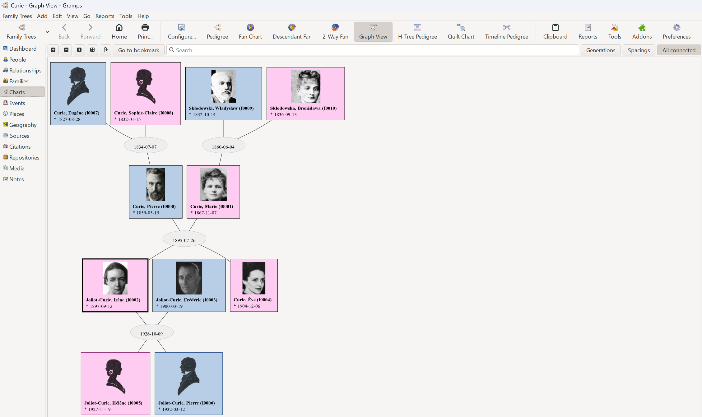
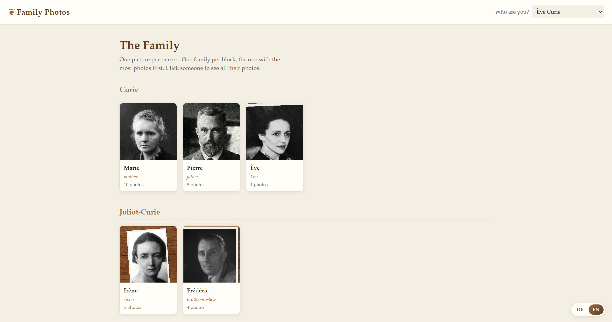
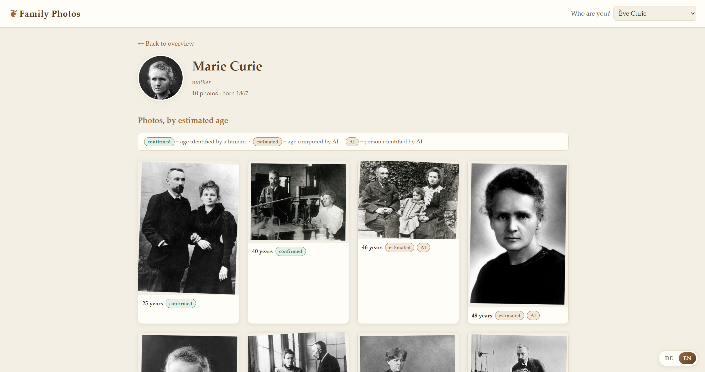
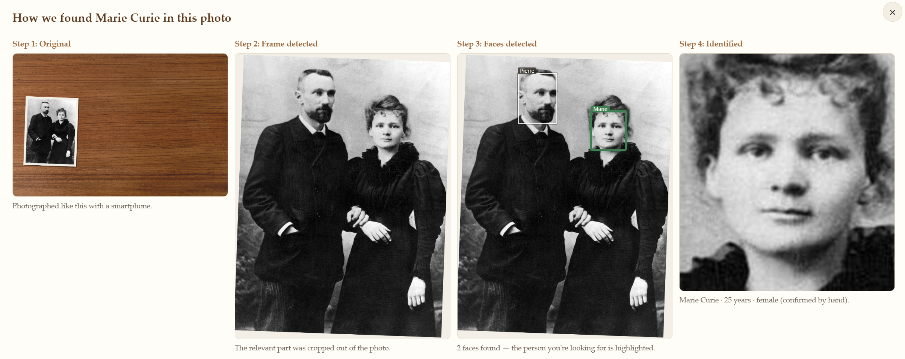

# Facial Recognition Pipeline for Categorizing Old Family Photos
This repository offers a pipeline to help with digitalizing and labelling old family photos. If your images are already digitalized, it is recommended to work directly with below libraries instead.

## Overview
Primary input to the pipeline are physical photo prints that are photographed via your smartphone.
The frame of the photo prints are detected using [SAM 3.1](https://github.com/facebookresearch/sam3/).
Afterwards, the bounding boxes of all faces in the images are detected.
Finally, the faces are recognized by [DeepFace](https://github.com/serengil/deepface) or [InsightFace](https://github.com/deepinsight/insightface) based on a hand-labelled ground truth reference gallery. 

The following image maps out the pipeline process, illustrated by a part of the frontend component:

Note: the pipeline also offers utilities to download encrypted images from an R2 compatible cloud storage as a first step.
A small presentation of the project can be found in `presentation.pdf`. For directory structure see `CLAUDE.md`.

## Quickstart
The pipeline is demonstrated on a small set of images from the Curie family.
The data directory for all steps is configured centrally via an environment variable in `.env` (see `.env.example`).
Switching this variable allows for easy demonstration of the pipeline and a quick to change to the real and private family photos.

Run the following command to see a demonstration of the process (requires only `uv` — it installs the dependencies on the first run automatically):
```bash
uv run --env-file .env.example ancestry
```

To get an overview of the pipeline have a look at `./quickstart/data` or look at the individual step outputs in `./quickstart/data/steps`.
When running the pipeline on your private family photos, the actual data directory and content will mirror exactly the one you see in `./quickstart/data`.

## Step: Frame Crop
In this step, the physical photo print in the image is identified. 
This is mostly for better viewing and to make the digitalization process less tedious.
I've tried classical computer vision methods (canny edge detection with morphological closing and contour tracing), which are available through the config.
However, these methods only got around a 60% detection rate, even after Hpopt.
Using SAM 3.1, I was able to get a 99.9% detection rate.
At the time of the project, SAM 3.1 was a brand-new image segmentation model.
It was quite difficult to get it to run and required several patches (see `scripts/setup_sam3.py`).

<table border="0">
  <tr>
    <td>
      
    </td>
    <td>
      
    </td>
  </tr>
</table>
The score represents the model's detection confidence for the frame quad, between 0 and 1.

Note that if you want to run this step with SAM, you need a sufficiently large and recent graphics card. You need CUDA 12.x drivers; set up SAM 3.1 and its checkpoints via `scripts/setup_sam3.py`. A V100 was able to run it.

All code for this step can be found in `src/pipeline/frame_crop`.

## Step: Face Crop

<table border="0">
  <tr>
    <td>
      
    </td>
    <td>
      
    </td>
  </tr>
</table>
The floating point numbers represent the model's detection confidence per face, between 0 and 1.

All code for this step can be found in `src/pipeline/face_crop`.

## Step: Facial Recognition
In this step the face crop is fed into the selected facial recognition library.
The library receives the ground truth located under `quickstart\data\curated\face_annotation\ground_truth.json` as a reference gallery.
Facial embeddings are computed once for the entire reference gallery as well as the input face crop.
The top k most likely identities are computed by comparing the input face crop embedding to all reference embeddings.
The identity of the most similar embeddings is assumed.
<table border="0">
  <tr>
    <td>
      
    </td>
    <td>
      
    </td>
  </tr>
</table>

InsightFace was able to provide age and gender estimation but they have turned out to be quite awful.

Note: InsightFace performed better than DeepFace for my set of ~2k mostly black-and-white photos. For this reason, InsightFace is the default in the config for this step. 

## Ground Truth Setup with Label Studio / Gramps
The family tree is expected to be curated through the open source software [Gramps](https://gramps-project.org/wiki/index.php/Main_page) and labelling through [Label Studio](https://labelstud.io/). However, these are not mandatory as long as the data is provided in the expected format.
Below is a screenshot of the Curie family tree in Gramps. 


All code for this step can be found in `src/pipeline/annotation` (Label Studio) and `src/pipeline/gramps` (Gramps).

## Optional: Hyperparameter Optimization
The pipeline also offers Hyperparameter Optimization with [Optuna](https://optuna.org/) for searching the parameter space and Experiment tracking with [Weights & Biases](https://wandb.ai/) for the main steps.
See `presentation.pdf` for some diagrams showcasing the results. The default values in all configs under `config/` come from the results of running Hpopt on my private ~2k mostly black-and-white family photos.
All code for this step can be found in `src/pipeline/experiments`.

## Frontend
The frontend is used to visualise your relatives with all the information that the pipeline was able to derive.
Select who you are via the dropdown on the top right and any information regarding kinship is updated.


Click on a specific person to see all images in which the pipeline was able to identify said person.
The images are sorted by estimated age, building a timeline. 


Click on an image for full-size viewing or click on the info button that appears when hovering over the image to get to the step-by-step processing breakdown of that image.


Launch the frontend with `uv run --group web ancestry-web`.
All code for the web application can be found in `src/web`.

## Developer Setup
The quickstart runs read-only on the committed dummy data. To run the pipeline on your own photos:

1. Create a local `.env` by copying `.env.example` to `.env`
2. Fill in only the secrets you use. Not all are mandatory.
3. Set up SAM 3.1 see [Step: Frame Crop](#step-frame-crop).
4. Add your data. Place your images under e.g. `data/raw/` and provide the ground truth.
5. Run the pipeline with `uv run ancestry`.

### Cluster deployment
The `deployment/` directory holds the setup I used to run the GPU steps on a Kubernetes cluster: Docker images, kustomize job manifests per step, and an SSH deployment for interactive work. This is tailored to the cluster available to me, so treat it as a reference rather than a turnkey setup. Some scripts assume that container environment — for example `scripts/setup_sam3.py` expects the in-container `/app/data` paths — and will need adapting to run elsewhere.

